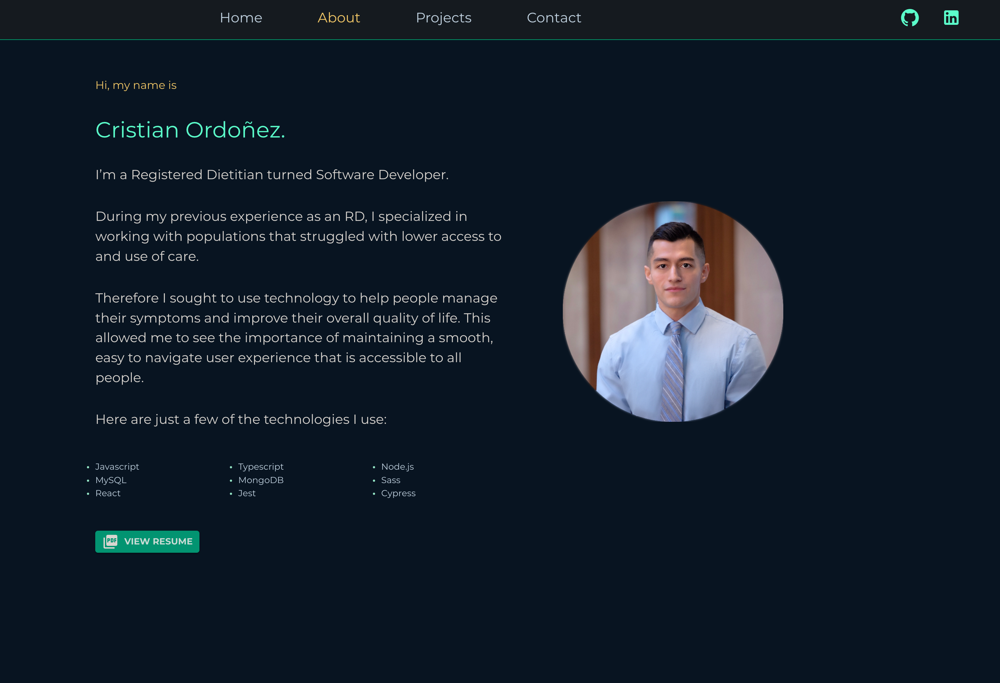
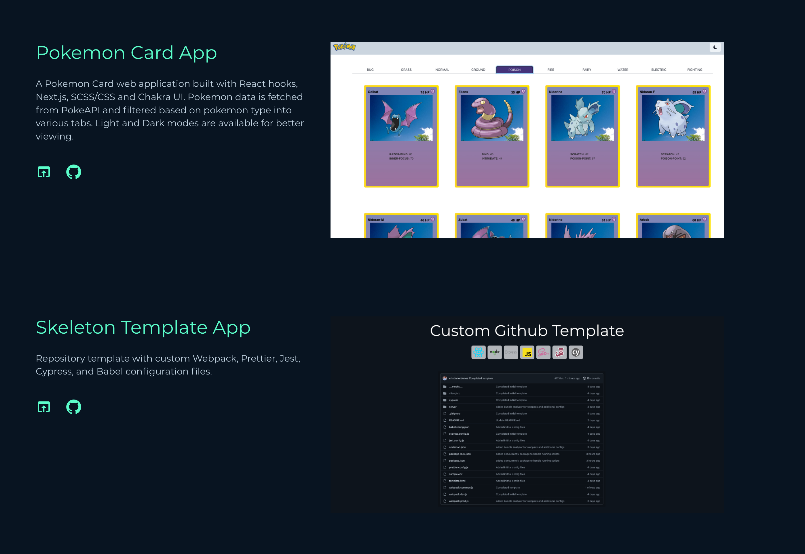

# Portfolio

This portfolio is a full-stack web application using the Github API, GraphQL, React, MongoDB, and Sass to showcase my online presence and featured projects.

## Live Link

View live deployment [here](www.cristianordonezrd.com) or see the demo below.

## Features & Usage

-  Integration with Github webhooks to keep featured projects updated
-  API requests sent using GraphQL to obtain necessary information including social media image
-  All project data is stored with MongoDB database and hosted with MongoDB Atlas

## Screenshots




## Tech Stack

This project was built using the following technologies:


## Setup/ Installation

-  Clone this repository and navigate to project directory in the terminal
-  Install necessary dependencies:

```bash
npm install
```

-  Obtain [Github](https://github.com/) API key and then create .env file (view sample.env in root directory for template):

```env
GITHUB_API_TOKEN="enter-api-token-here"
NODE_ENV="development" || "production"
```

-  Then, if environment is set to development, run the application like so:

```bash
npm run dev
```

This opens a development server in your local browser at port 3000.

-  When application is ready for production, have webpack build your bundle and minimize your files:

```bash
npm start
```

Then navigate to port 8080 in your browser to view your application. Or push to Github main branch to begin automated Heroku production build:

```bash
git push origin main
```

## Testing

-Run unit tests with Jest/React Testing Library:

```bash
npm test
```

-Then run end to end tests with Cypress:

```bash
npm run cypress
```

## Resources (include useful or related links)

-  [Improved security of website or application with Cloudflare](https://www.cloudflare.com/)
-  [Getting app ready for heroku deployment](https://devcenter.heroku.com/articles/preparing-a-codebase-for-heroku-deployment)
-  [MongoDB Atlas for DB hosting](https://www.mongodb.com/cloud/atlas/lp/try2?utm_content=rlsavisitor&utm_source=google&utm_campaign=gs_americas_uscan_search_core_brand_atlas_desktop_rlsa&utm_term=mongodb%20atlas&utm_medium=cpc_paid_search&utm_ad=e&utm_ad_campaign_id=14291004479&adgroup=128837427307&gclid=Cj0KCQjwhqaVBhCxARIsAHK1tiOPiMcUkWIb4qkCZ0XPpMXPyTg6LjP9Lj2WYlgis6eT9VkGFFiK0B4aArHFEALw_wcB)
